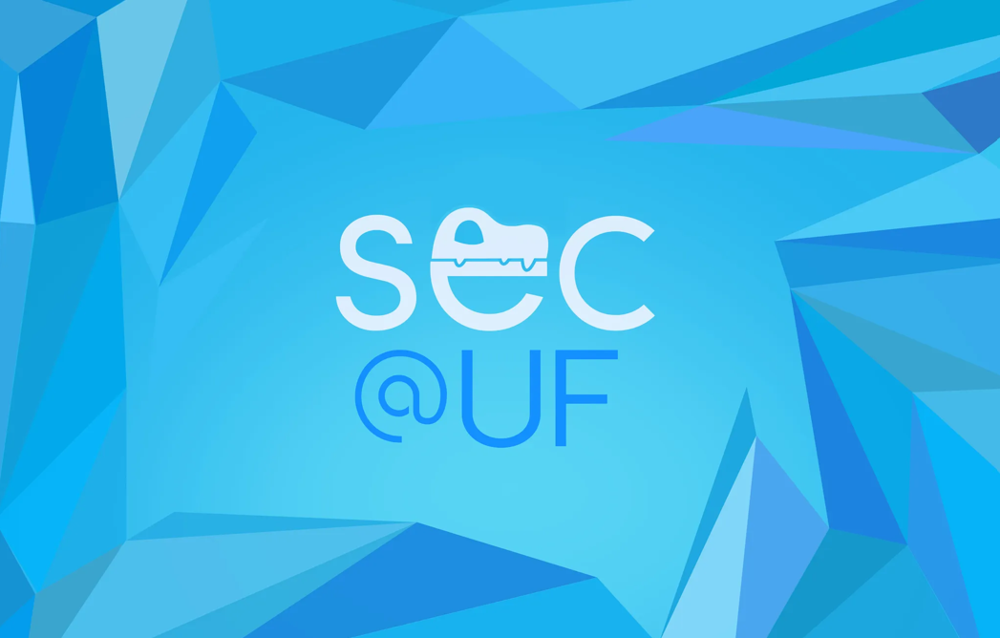
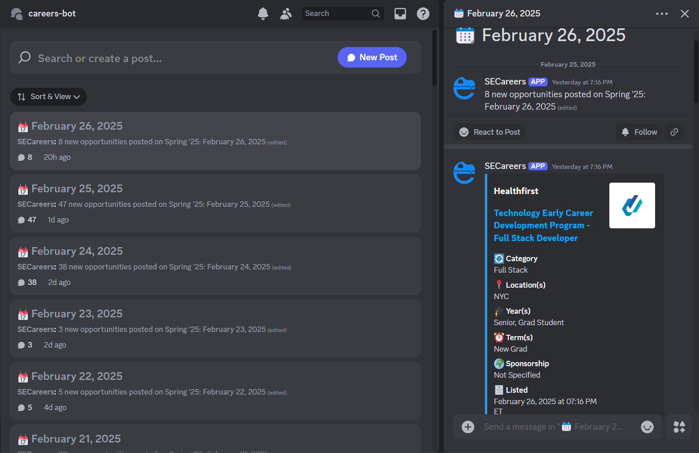

# SECareers ≈ Opportunities Discord Bot

## ⚙️ **Key Features**

### 🤖 Real-time Opportunity Tracking  
- Continuously monitors and posts the **latest active internship, co-op, and new grad positions** from Simplify's summer, offseason, and new grad repositories.  
- Posts opportunities in **real-time** to organized **daily threads** in our designated careers-bot channel for easy navigation.

### 📋 Smart Categorization  
- Automatically categorizes positions (SWE, Frontend, AI/ML, etc.) 
- Provides detailed breakdowns including company, role, location, eligibility, and sponsorship information.

### 🔔 Customizable Notifications
- Users can set notification preferences to **never miss relevant opportunities.
- For instant alerts, right-click the careers-bot channel and change notification settings to "All Messages".
- Bot retrieves and posts the **current day's listings** from the S3 bucket.

---

## 🛠️ **Tech Stack**

- **Python**: Core programming language for bot functionality
  - **Discord.py**: Framework for Discord integration
  - **BeautifulSoup**:Web scraping for opportunity sources  
- **MongoDB**: Stores opportunity listings and prevents duplicates. 
- **Node.js**: Used with PM2 for process management.
- **Oracle VM**: Hosts the bot for 24/7 uptime.

---

## 👥 **Software Engineering Club @ University of Florida**  

SECareers was developed by the Software Engineering Club @ University of Florida to help students find their next opportunity.
We hope SECareers enhances your job search experience. For questions or issues, don't hesitate to open an issue or reach out.

Here's to landing our dream careers! 💼

---

### 📝 **How to get Started**
Connect with the UF Software Engineering Club and access SECareers by joining our Discord!
https://discord.gg/Z7ka9VEt
